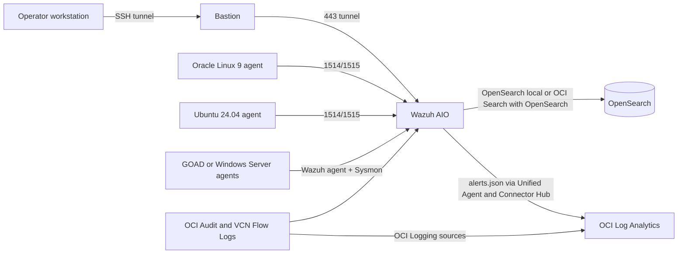
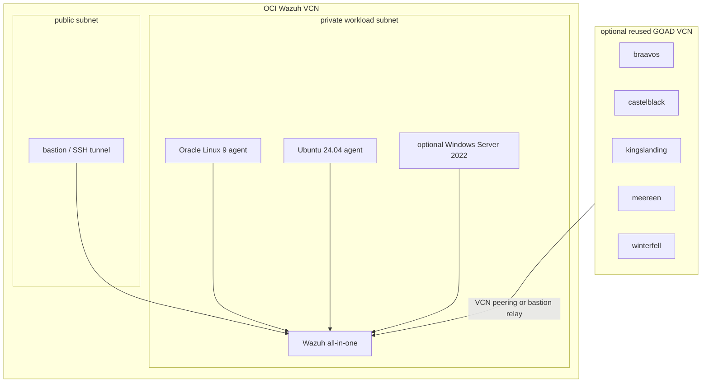
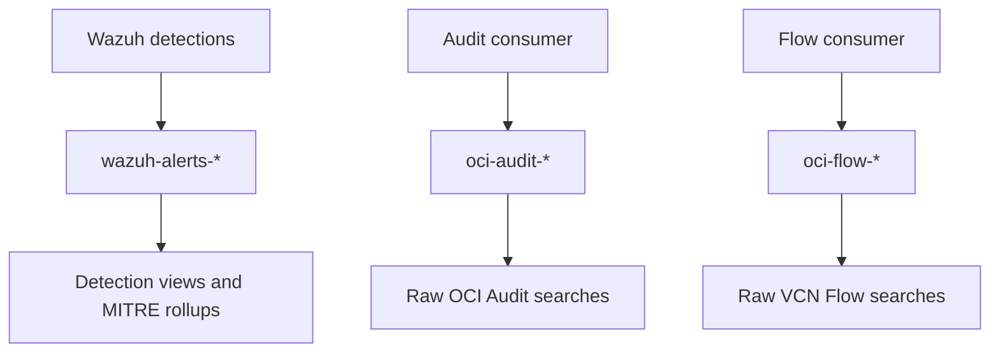
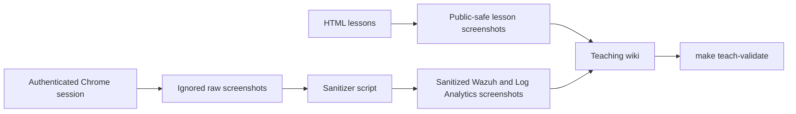
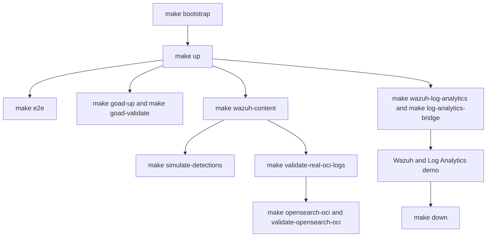
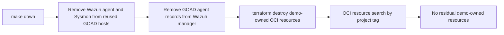

# OCI Wazuh and Log Analytics Architecture

This page defines the publishable architecture and workflows for the OCI Wazuh detection lab. It intentionally avoids real tenancy identifiers, IP addresses, credentials, and internal-only topology.

## System Context



## OCI Network Topology



## Telemetry Ingestion Workflow

```mermaid
flowchart LR
  Audit[OCI Audit API] --> AuditConsumer[Wazuh OCI Audit consumer]
  Flow[VCN Flow Logs] --> Logging[OCI Logging]
  Logging --> SCH[Connector Hub]
  SCH --> Stream[OCI Streaming]
  Stream --> FlowConsumer[Wazuh Flow consumer]

  AuditConsumer --> AuditFile[/var/ossec/logs/oci/audit.json]
  FlowConsumer --> FlowFile[/var/ossec/logs/oci/flow.json]

  AuditFile --> Logcollector[Wazuh logcollector]
  FlowFile --> Logcollector
  Logcollector --> Rules[Custom decoders and rules 100000+]
  Rules --> Alerts[wazuh-alerts-*]
```

## OpenSearch Data Model



Use `wazuh-alerts-*` for detections. Use `oci-audit-*` and `oci-flow-*` for normalized raw OCI source records.

## Log Analytics Correlation Workflow

```mermaid
flowchart LR
  WazuhAlertsFile[/var/ossec/logs/alerts/alerts.json] --> UnifiedAgent[OCI Unified Agent]
  UnifiedAgent --> OCILogging[OCI Logging custom log]
  OCILogging --> SCH[Connector Hub]
  SCH --> LA[OCI Log Analytics]

  AuditLogs[OCI Audit Logs] --> LA
  FlowLogs[OCI VCN Flow Unified Schema Logs] --> LA
  LinuxLogs[Linux Syslog and Secure Logs] --> LA
  WindowsLogs[Windows Security and Sysmon Events] --> LA

  LA --> Dashboard[Correlation dashboards]
  Dashboard --> Backlog[Security posture backlog]
```

## Teaching and Screenshot Publishing Workflow



Raw authenticated screenshots live under `docs/wiki/assets/live/` and are ignored by Git. Only sanitized screenshots should be committed.

## Validation Workflow



## Teardown Workflow



## Security Boundaries

- No dashboard is intentionally exposed to the public internet.
- Wazuh Dashboard access should use an SSH tunnel.
- OCI identifiers, credentials, internal IPs, and authenticated raw screenshots must not be committed.
- Public docs use placeholders and sanitized screenshots.
- `make teach-validate` checks required teaching assets, local links, ignored raw-auth paths, and redaction-sensitive patterns.

## Primary References

- [End-to-end demo runbook](../END_TO_END_DEMO.md)
- [Ingestion KB](../kb/KB-OCI-WAZUH-INGESTION.md)
- [Runbook KB](../kb/KB-OCI-WAZUH-RUNBOOK.md)
- [Teaching module index](WAZUH_LOG_ANALYTICS_MODULE_INDEX.md)
