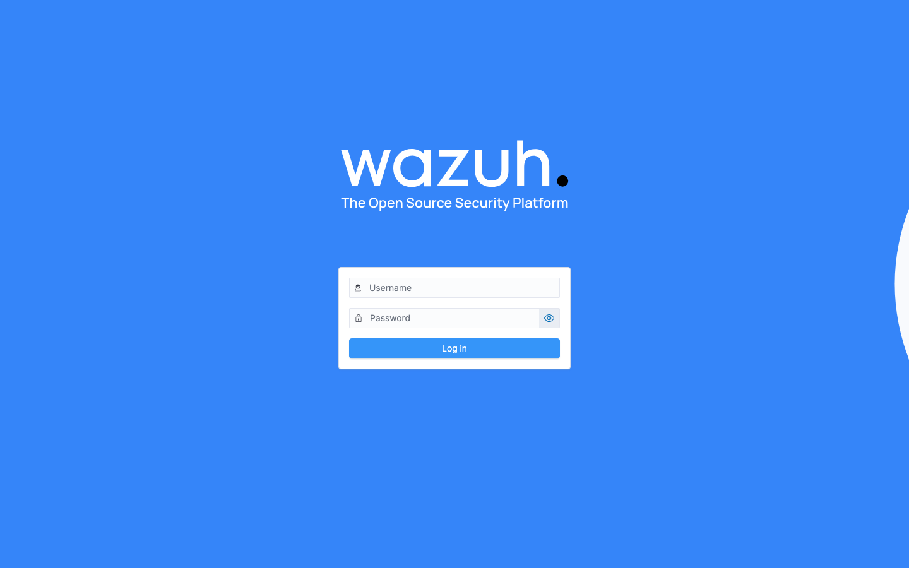
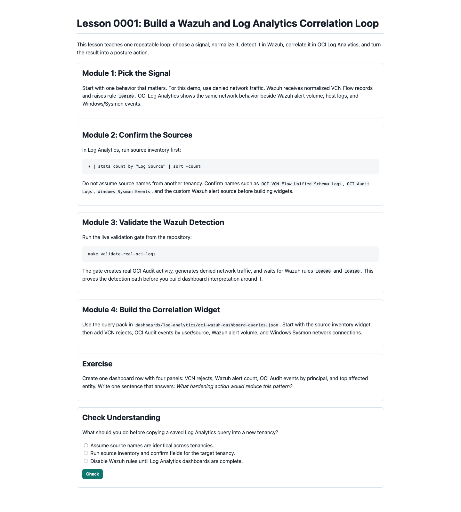
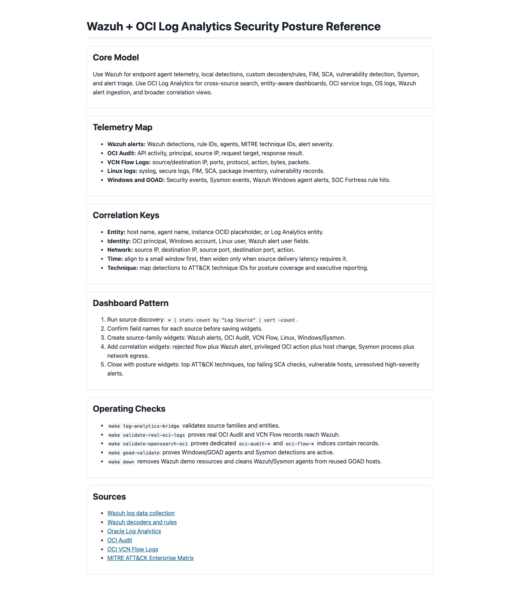

# Wazuh and OCI Log Analytics Hands-On Walkthrough

Use this walkthrough when teaching the demo end to end. It assumes the repository is already cloned and the operator has filled local Terraform variables, OCI CLI configuration, and required Vault or environment secrets. Do not paste real OCIDs, IPs, passwords, or tenancy names into this file.

## Screenshot Gallery

The screenshots below are intentionally public-safe.



The Wazuh dashboard is reached through a local tunnel. The screenshot proves the web app is reachable without exposing the public bastion address or credentials.



This is the first teaching lesson: pick one signal, confirm sources, validate Wazuh detection, and build the Log Analytics correlation widget.



The printable reference compresses the telemetry map, correlation keys, dashboard pattern, and operating checks for classroom or workshop use.

## Step 1: Prepare the Workstation

```bash
cd /Users/abirzu/dev/OCI-Wazuh
make bootstrap
make cap-preflight
```

For public or standalone deployment, copy the example variables and fill only local files:

```bash
cp terraform/terraform.tfvars.example terraform/terraform.tfvars
$EDITOR terraform/terraform.tfvars
```

Keep real secrets in OCI Vault, environment variables, or local ignored files.

## Step 2: Deploy the Wazuh Lab

For CAP development, the helper resolves local OCI configuration and writes local Terraform variables:

```bash
USE_BASTION_SUBNET_FOR_WORKLOADS=true \
WORKLOAD_ASSIGN_PUBLIC_IP=true \
make up
```

For public standalone use after editing `terraform/terraform.tfvars`:

```bash
make up
```

Expected result:

- Wazuh all-in-one node is created.
- Oracle Linux 9 and Ubuntu 24.04 agents are created.
- NSGs, host firewall rules, Vault integration, and log paths are configured.
- Wazuh dashboard is reachable through the tunnel command from Terraform output.

## Step 3: Open Wazuh Dashboard

Get the tunnel command:

```bash
terraform -chdir=terraform output -raw wazuh_dashboard_tunnel_command
```

Run the printed SSH command in a separate terminal, then open:

```text
https://127.0.0.1:8443
```

Teaching checkpoint:

- Show the Wazuh login screen.
- Explain that the dashboard is not exposed publicly.
- After login, open Discover and show the available data views: `wazuh-alerts-*`, `oci-audit-*`, and `oci-flow-*` when OpenSearch OCI content has been configured.

## Step 4: Validate Wazuh and Linux Agent Detections

```bash
make e2e
```

Expected green evidence:

- Wazuh manager services are healthy.
- Linux agents are active.
- FIM test produces an alert.
- Validation output is written under `artifacts/validation/`.

Dashboard teaching path:

1. Open Wazuh Dashboard.
2. Select `wazuh-alerts-*`.
3. Filter for Linux FIM or SCA signals:

```text
rule.groups: syscheck or rule.groups: sca
```

4. Add columns for `timestamp`, `agent.name`, `rule.id`, `rule.description`, `syscheck.path`, and `rule.mitre.id`.

## Step 5: Reuse or Install GOAD and Enroll Windows Agents

Discover GOAD first:

```bash
make goad-discover
```

If GOAD exists and is reachable:

```bash
make goad-up
make goad-validate
```

If GOAD is missing, deploy GOADv3 in OCI first, then rerun discovery and enrollment.

Wazuh dashboard filter for the GOAD path:

```text
agent.name: (braavos or castelblack or kingslanding or meereen or winterfell) or rule.groups: windows
```

Teaching checkpoint:

- Show active Windows agents.
- Show Sysmon or Windows Security events.
- Explain that teardown must remove Wazuh agents and Sysmon from reused GOAD hosts.

## Step 6: Deploy OCI Decoders, Rules, and Consumers

```bash
make wazuh-content
make simulate-detections
```

Expected green output:

- OCI Audit decoder/rules ready.
- VCN Flow decoder/rules ready.
- Consumer systemd service ready.
- Synthetic Audit rule `100000` and Flow rule `100100` fire.

Wazuh dashboard filters:

```text
rule.id >= 100000 and rule.id <= 100099
```

```text
rule.id >= 100100 and rule.id <= 100199
```

## Step 7: Validate Real OCI Audit and VCN Flow Logs

```bash
make validate-real-oci-logs
```

This gate performs real OCI actions and waits for matching Wazuh alerts. It proves the reusable path works with real tenancy telemetry, not only synthetic samples.

Expected green output:

```text
real_oci_logs=green
audit_rule_100000=green
flow_rule_100100=green
```

If the gate is slow, explain the delivery chain:

```text
OCI Audit API -> Wazuh Audit consumer -> Wazuh logcollector -> rule 100000
VCN Flow Logs -> Connector Hub -> Streaming -> Wazuh Flow consumer -> Wazuh logcollector -> rule 100100
```

## Step 8: Create Dedicated OpenSearch Data Views

```bash
make opensearch-oci
make validate-opensearch-oci
```

Expected green output:

```text
opensearch_oci=green
oci_audit_count=<nonzero>
oci_flow_count=<nonzero>
dashboard.oci_logs_overview=ready
```

Teaching checkpoint:

- Use `wazuh-alerts-*` for detections.
- Use `oci-audit-*` for raw normalized OCI Audit records.
- Use `oci-flow-*` for raw normalized VCN Flow records.
- Explain that Wazuh uses OpenSearch under the hood, but the raw OCI source indices are separate from Wazuh alert indices.

## Step 9: Send Wazuh Alerts to OCI Log Analytics

```bash
make wazuh-log-analytics
make log-analytics-bridge
```

Expected green output includes:

```text
namespace=ready
source.OCI Audit Logs=ready
source.OCI VCN Flow Unified Schema Logs=ready
source.Windows Sysmon Events=ready
log_analytics_bridge=ready
```

If Log Analytics queries return zero rows immediately after configuration, wait for Unified Agent, Connector Hub, and Log Analytics propagation, then generate another Wazuh alert with `make e2e`.

## Step 10: Build OCI Log Analytics Dashboards

Open OCI Console:

```text
Observability & Management > Log Analytics > Log Explorer
```

Run source discovery first:

```text
* | stats count by "Log Source" | sort -count
```

Then build saved searches from:

```text
dashboards/log-analytics/oci-wazuh-dashboard-queries.json
```

Minimum dashboard panels:

| Panel | Query ID |
|---|---|
| Telemetry Source Inventory | `source_inventory` |
| VCN Flow Actions | `vcn_flow_actions` |
| VCN Rejects by Source and Destination | `vcn_rejects_by_pair` |
| OCI Audit Events by Type | `oci_audit_events` |
| OCI Audit Events by User and Source | `oci_audit_users` |
| GOAD Sysmon Event IDs | `windows_sysmon_event_ids` |
| GOAD Sysmon Network Connections | `windows_sysmon_network` |
| Linux Host Logs by Source | `linux_host_logs` |
| Wazuh Alert Volume | `wazuh_alert_volume` |
| Wazuh Alerts Raw Search | `wazuh_alert_raw_search` |

## Step 11: Teach the Security Posture Loop

For each detection family, ask the same five questions:

1. What source produced this signal?
2. Which entity, identity, or network key lets us join it to other telemetry?
3. Which ATT&CK technique or control gap does it represent?
4. What hardening action would reduce the risk?
5. Which Wazuh or Log Analytics query proves the action worked?

Example:

| Detection | Correlation | Hardening action | Verification |
|---|---|---|---|
| VCN rejected traffic spike | Wazuh rule `100100` plus Log Analytics VCN rejects by pair | Restrict NSGs or investigate scanner source | Reject count drops and no matching Wazuh spike |
| Privileged OCI API activity | Wazuh Audit rule `100000` plus OCI Audit by user/source | Review IAM policy and MFA posture | Same action requires approved identity path |
| Sysmon network event from GOAD | Wazuh Windows/Sysmon alert plus VCN flow | Improve AD segmentation | No unexpected east-west flow remains |

## Step 12: Capture Fresh Screenshots

Use local screenshots only after verifying they contain no secrets or tenant identifiers.

```bash
# Terminal 1
python3 -m http.server 8765
```

```bash
# Terminal 2
npx playwright screenshot --viewport-size=1440,1100 --full-page \
  http://127.0.0.1:8765/lessons/0001-siem-correlation-loop.html \
  docs/wiki/assets/lesson-0001-correlation-loop.png
npx playwright screenshot --viewport-size=1440,1100 --full-page \
  http://127.0.0.1:8765/reference/0001-wazuh-log-analytics-security-posture.html \
  docs/wiki/assets/reference-security-posture.png
npx playwright screenshot --ignore-https-errors --wait-for-timeout=8000 \
  --viewport-size=1440,900 \
  https://127.0.0.1:8443/app/login \
  docs/wiki/assets/wazuh-login.png
```

Before committing, inspect images and run a redaction scan:

```bash
rg -n 'ocid1\.|130\.61\.|161\.153\.|144\.24\.|129\.153\.|141\.147\.|82\.77\.|109\.166\.' docs/wiki assets lessons reference
```

## Step 13: Teardown

```bash
make down
```

This removes demo-owned resources and runs the GOAD cleanup path for reused hosts. Confirm there are no demo-tagged residual resources with the structured search command in [END_TO_END_DEMO](../END_TO_END_DEMO.md).
