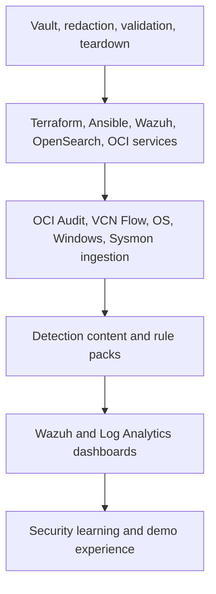

# OCI Wazuh Product Capabilities

This page explains the product capabilities demonstrated by the OCI Wazuh Detection Lab. It is written for evaluators, security leaders, platform owners, and engineers who need to understand what the lab proves before they invest in a production rollout.

## Capability Map

| Capability | What the demo proves | Primary evidence | Expansion path |
|---|---|---|---|
| Endpoint detection | Linux and Windows agents enroll, collect logs, and raise Wazuh alerts. | Active agents, FIM alerts, SCA results, Sysmon events | Add more OS baselines, EDR feeds, and host groups |
| Cloud audit detection | Real OCI Audit events are normalized and detected in Wazuh. | `oci-audit-*`, rule IDs `100000-100099` | Add high-risk IAM, network, key, and compute detections |
| Network detection | VCN Flow Logs are parsed, indexed, and correlated. | `oci-flow-*`, rule IDs `100100-100199` | Add beaconing, unusual egress, deny spikes, and top-talker baselines |
| AD lab reuse | Existing GOAD hosts can be monitored without owning the AD lab lifecycle. | GOAD agents, Sysmon events, SOC Fortress alerts | Add attack simulations and ATT&CK coverage reporting |
| SIEM correlation | Wazuh detections and OCI Log Analytics dashboards answer the same investigation question. | Shared time window, source inventory, dashboard row | Add cross-source incident timelines |
| OpenSearch data products | Raw OCI Audit and Flow records can live in dedicated OpenSearch indices. | `oci-audit-*`, `oci-flow-*`, saved searches | Add retention policies and role-specific dashboards |
| Log Analytics bridge | Wazuh alerts and host logs can be searched beside OCI service logs. | Log Analytics query pack and source inventory | Add executive dashboards and entity enrichment |
| Teardown safety | Demo-owned resources are removed, and reused hosts are cleaned. | `make down`, GOAD cleanup, resource search | Add scheduled teardown and drift checks |
| Teaching reuse | The same lab can run as a workshop, internal training path, or customer demo. | Lessons, facilitator guide, handout, assessment | Add role-specific exercises and certification rubrics |

## Product Layers

The product is more than a Terraform deployment. It is a repeatable detection operating model with infrastructure, collection, content, visualization, validation, training, and cleanup.

## What Users Can Do

### Deploy a Standalone Lab

Users can deploy the lab in their own tenancy with local configuration and no hardcoded tenancy identifiers. The deploy path creates Wazuh, Linux agents, network resources, ingestion components, optional Windows assets, and validation scripts.

Useful for:

- security team demos,
- SIEM/EDR evaluation,
- OCI logging education,
- detection engineering practice,
- customer workshops.

### Attach to OCI-DEMO

The project can be attached as an external component to OCI-DEMO. In that mode it should reuse parent prerequisites where possible and expose a passthrough target such as `make wazuh-demo-up`.

Useful for:

- larger cloud security storylines,
- shared demo environments,
- cross-project training,
- reuse of existing GOAD or networking assets.

### Choose an Ingestion Model

The lab supports multiple ingestion patterns so users can match their tenancy maturity and permissions.

| Mode | Best for | Tradeoff |
|---|---|---|
| Streaming | Real-time VCN Flow delivery through Connector Hub and Streaming | Requires Streaming and connector permissions |
| Object Storage | Tenancies where bucket delivery is easier to approve | Higher latency and polling complexity |
| Direct API | Audit-focused validation and restricted development paths | Not a complete replacement for service log pipelines |
| Log Analytics bridge | Enterprise correlation and reporting | Requires Log Analytics onboarding and source governance |
| OpenSearch indexing | Raw OCI record exploration in Wazuh/OpenSearch | Requires index lifecycle and dashboard ownership |

### Prove End-to-End Detection

The product has deterministic gates instead of only manual screenshots.

| Gate | Proves |
|---|---|
| `make e2e` | Wazuh and Linux agent path works |
| `make goad-validate` | Windows or GOAD host monitoring is active |
| `make simulate-detections` | Decoders and rules fire for known normalized records |
| `make validate-real-oci-logs` | Real OCI Audit and VCN Flow records reach Wazuh |
| `make validate-opensearch-oci` | Dedicated OCI indices and views exist |
| `make log-analytics-bridge` | Wazuh and host telemetry reach OCI Log Analytics |
| `make down` | Demo-owned resources and reused-host agents are cleaned |

## Core Personas

| Persona | Primary question | Best entry point |
|---|---|---|
| SOC analyst | How do I investigate a signal across endpoint, cloud, and network data? | [Learning Curve and Role Paths](WAZUH_LOG_ANALYTICS_LEARNING_CURVE.md) |
| Cloud security engineer | How do OCI Audit and VCN Flow records become detections? | [Hands-on walkthrough](WAZUH_LOG_ANALYTICS_HANDS_ON.md) |
| Detection engineer | How do I add, test, and tune rules safely? | [Query cookbook](WAZUH_LOG_ANALYTICS_QUERY_COOKBOOK.md) |
| Platform engineer | What resources, permissions, and teardown paths exist? | [Architecture and workflows](WAZUH_LOG_ANALYTICS_ARCHITECTURE.md) |
| Security leader | What posture improvement does this enable? | [Security posture wiki](WAZUH_LOG_ANALYTICS_SECURITY_POSTURE.md) |
| Workshop facilitator | How do I teach this consistently? | [Facilitator guide](WAZUH_LOG_ANALYTICS_FACILITATOR_GUIDE.md) |

## Demo Stories

### Story 1: Cloud Control-Plane Change

1. Generate or find a real OCI Audit event.
2. Confirm the normalized record in `oci-audit-*`.
3. Confirm Wazuh rule `100000` or a more specific OCI Audit rule.
4. Pivot to Log Analytics for principal, source, time window, and related host activity.
5. Decide whether to accept, investigate, harden, or tune.

### Story 2: Denied Network Traffic

1. Generate denied traffic against a monitored subnet or host.
2. Confirm VCN Flow delivery and normalized fields.
3. Confirm Wazuh rule `100100` for rejected traffic.
4. Build a Log Analytics dashboard row with source, destination, port, action, bytes, and packets.
5. Convert the result into an NSG, routing, scanner, or owner action.

### Story 3: GOAD Windows Signal

1. Enroll the GOAD hosts as Wazuh agents.
2. Confirm Sysmon and Windows event collection.
3. Generate a benign authentication or process event.
4. Confirm the SOC Fortress-aligned rule path.
5. Correlate Windows events with Wazuh alerts and network telemetry.

### Story 4: Endpoint Drift

1. Trigger a Linux FIM event or review SCA findings.
2. Confirm the Wazuh alert and host identity.
3. Search Log Analytics for supporting OS logs in the same time window.
4. Create a posture backlog item with owner, action, verification query, and due date.

## Product Maturity Model

| Level | State | Capabilities expected |
|---|---|---|
| 0. Demo | A single lab deployment works. | Wazuh, two Linux agents, optional Windows/GOAD, synthetic detections |
| 1. Evidence | Real OCI logs are flowing. | Audit and Flow validation, OpenSearch indices, Wazuh rules |
| 2. Correlation | Dashboards answer investigation questions. | Log Analytics source inventory, cross-source dashboard rows |
| 3. Operations | The lab is repeatable and safe. | Runbooks, teardown, cost guardrails, validation artifacts |
| 4. Program | The approach informs production posture. | Ownership model, ATT&CK coverage, detection lifecycle, executive metrics |

## What This Is Not

- It is not a replacement for production SIEM architecture review.
- It is not a promise that every OCI service log source is enabled by default.
- It is not a place to commit real tenancy data, credentials, Terraform state, or raw screenshots.
- It is not limited to one tenancy; public deployment should remain fully parameterized.

## Related Pages

- [Learning Curve and Role Paths](WAZUH_LOG_ANALYTICS_LEARNING_CURVE.md)
- [Architecture and workflows](WAZUH_LOG_ANALYTICS_ARCHITECTURE.md)
- [Security posture wiki](WAZUH_LOG_ANALYTICS_SECURITY_POSTURE.md)
- [Hands-on walkthrough](WAZUH_LOG_ANALYTICS_HANDS_ON.md)
- [Assessment](WAZUH_LOG_ANALYTICS_ASSESSMENT.md)
