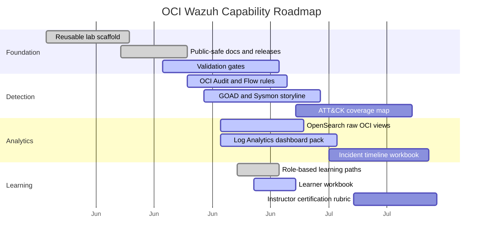

# OCI Wazuh Product Roadmap and Use Cases

This page turns the demo into a product roadmap. Use it to decide what to build next, what to show in a customer or internal demo, and what evidence proves each capability is ready.

## Roadmap Themes

| Theme | Goal | Near-term proof | Longer-term expansion |
|---|---|---|---|
| Deployable detection lab | Any user can deploy, validate, and destroy the lab. | `make up`, `make e2e`, `make down` | Region packs, marketplace image, Resource Manager stack |
| Real OCI telemetry | OCI Audit and VCN Flow Logs are real, parsed, and searchable. | `make validate-real-oci-logs` | More OCI service log families and service-specific detections |
| Endpoint and AD coverage | Linux, Windows, Sysmon, and GOAD detections work together. | Active agents and Sysmon/SOC Fortress alert | Attack simulation library and ATT&CK heat map |
| Correlation dashboards | Wazuh, OpenSearch, and Log Analytics answer the same question. | Shared dashboard row for one investigation | Guided incident workbench and timeline export |
| Learning product | Teams can learn the workflow without tribal knowledge. | Lessons, workbook, facilitator guide | Role-based certification and scoring automation |
| Production readiness | A demo can become a governed pilot. | Maturity model and backlog | Multi-compartment onboarding, retention policy, SSO, RBAC |

## Product Roadmap



The dates are planning placeholders for the public roadmap. Update them when a release plan is committed.

## Use Case Catalog

| Use case | Audience | Demo question | Required sources | Success evidence |
|---|---|---|---|---|
| Cloud admin activity review | Cloud security | Who changed a resource and from where? | OCI Audit, Wazuh Audit rules, Log Analytics | Event type, principal, source IP, compartment |
| Denied traffic investigation | SOC and network | Is this expected scanning or suspicious discovery? | VCN Flow, Wazuh Flow rules, Log Analytics | Source, destination, port, action, count |
| Host drift response | Platform and SOC | Which host drifted from baseline? | Wazuh FIM/SCA, Linux logs | Alert, file/check, owner, remediation |
| Windows lab detection | Detection engineer | Can AD-like Windows events be detected? | GOAD or Windows, Sysmon, SOC Fortress rules | Active agents and one benign simulated alert |
| Vulnerable exposed workload | Cloud security | Is a vulnerable host exposed by network policy? | Wazuh vulnerability data, VCN Flow | Vulnerability, host, accepted flow evidence |
| Executive posture report | Security leader | Which risks are decreasing or unresolved? | Wazuh alerts, Log Analytics metrics, backlog | Trend, owner, due date, verification query |

## Capability Backlog

| Priority | Capability | Why it matters | Done when |
|---|---|---|---|
| P0 | Real-log validation reliability | Users must trust the demo uses real OCI logs. | Audit and Flow gates pass from a clean deploy |
| P0 | GOAD cleanup reliability | Reused environments must not retain demo agents. | `make down` removes agents, Sysmon, relay, and manager records |
| P1 | More OCI Audit rules | Cloud control-plane detections need depth. | IAM, network, key, compute, and logging changes have named rules |
| P1 | ATT&CK coverage page | Security leaders need coverage language. | Rule catalog maps to techniques and demo stories |
| P1 | Dashboard import automation | Manual dashboard creation slows adoption. | Wazuh and Log Analytics dashboard assets can be applied repeatably |
| P2 | Multi-tenancy onboarding guide | Public users need to adapt to their tenancy safely. | Prerequisite checklist and common policy examples are documented |
| P2 | Production pilot guide | Demo users need a path to governed pilot. | RBAC, retention, SSO, logging cost, and owner model are documented |
| P3 | Certification exercises | Training needs repeatable scoring. | Workbook exercises have scoring keys and expected evidence |

## Prioritization Model

Score each candidate from 1 to 5.

| Factor | Question |
|---|---|
| Security value | Does this reduce risk or improve detection coverage? |
| Demo value | Does this make the story easier to show? |
| Reuse value | Can this be reused by other OCI security projects? |
| Validation clarity | Can a binary gate prove it works? |
| Cost control | Does it avoid unnecessary resources or spend? |
| Teardown safety | Does it preserve clean destroy behavior? |

Recommended formula:

```text
priority_score = security_value + demo_value + reuse_value + validation_clarity + cost_control + teardown_safety
```

Promote backlog items with a score of 24 or higher into the next release candidate.

## Release Tracks

| Track | Example release | Content |
|---|---|---|
| Docs | `v0.1.x` | Wiki, learning content, diagrams, runbooks, templates |
| Validation | `v0.2.x` | More deterministic gates, better failure diagnostics |
| Detection | `v0.3.x` | New rule packs, ATT&CK mapping, simulations |
| Analytics | `v0.4.x` | Dashboard import automation and correlation packs |
| Deployment | `v0.5.x` | Region portability, Resource Manager, OCI-DEMO integration |
| Pilot | `v1.0.x` | Production pilot guide, RBAC, retention, support model |

## Product Metrics

| Metric | Target signal | Collection path |
|---|---|---|
| Time to first Wazuh login | Operator reaches dashboard quickly | Runbook checkpoint |
| Time to first real OCI alert | Audit or Flow alert appears within validation window | `make validate-real-oci-logs` |
| Detection coverage | Rules mapped to ATT&CK and use cases | Detection catalog |
| Teardown completeness | No demo-owned residual resources | Post-destroy resource search |
| Training completion | Learner can finish role path and workbook | Workbook rubric |
| Dashboard usefulness | Each widget maps to one decision | Facilitator review |

## Demo Packaging Checklist

- [ ] Hosted docs are current.
- [ ] Release tag exists for the demo version.
- [ ] `make lint` passes.
- [ ] `make teach-validate` passes.
- [ ] Secret scan is clean.
- [ ] Wazuh dashboard access is tunnel-only.
- [ ] OCI Audit and VCN Flow validation output is captured.
- [ ] GOAD or Windows path is either validated or explicitly marked skipped.
- [ ] Log Analytics source inventory is captured.
- [ ] Teardown command and expected cleanup are shown.

## Related Pages

- [Product capabilities](WAZUH_LOG_ANALYTICS_PRODUCT_CAPABILITIES.md)
- [Adoption guide](WAZUH_LOG_ANALYTICS_ADOPTION_GUIDE.md)
- [Learning curve and role paths](WAZUH_LOG_ANALYTICS_LEARNING_CURVE.md)
- [Learner workbook](WAZUH_LOG_ANALYTICS_LEARNER_WORKBOOK.md)
- [Glossary and FAQ](WAZUH_LOG_ANALYTICS_GLOSSARY_FAQ.md)
- [Architecture and workflows](WAZUH_LOG_ANALYTICS_ARCHITECTURE.md)
- [End-to-end demo runbook](../END_TO_END_DEMO.md)
