# Wazuh and OCI Log Analytics Security Posture Wiki

This page is the teaching entry point for using Wazuh and OCI Log Analytics together to improve enterprise security posture. It is public-safe by design: do not add real OCIDs, IP addresses, credentials, tenancy namespaces, or internal-only screenshots.

## Learning Path

| Module | Outcome | Hands-on artifact |
|---|---|---|
| 1. Telemetry inventory | Identify which sources exist and what each source proves. | Log Analytics source inventory query |
| 2. Wazuh endpoint posture | Use Wazuh FIM, SCA, syscollector, vulnerability detection, Linux logs, Windows logs, and Sysmon. | Wazuh views over `wazuh-alerts-*` |
| 3. OCI cloud telemetry | Ingest OCI Audit and VCN Flow Logs into Wazuh and dedicated OpenSearch indices. | `oci-audit-*` and `oci-flow-*` data views |
| 4. Log Analytics bridge | Send Wazuh alerts and host telemetry into OCI Log Analytics. | Log Analytics dashboard query pack |
| 5. Correlation patterns | Correlate endpoint, cloud control-plane, and network signals. | Cross-source dashboard row |
| 6. Posture improvement | Convert detections into hardening actions and ATT&CK coverage. | Posture backlog |
| 7. Operations and teardown | Validate, operate, upgrade, and remove the lab safely. | End-to-end runbook |
| 8. Troubleshooting | Isolate source, delivery, parser, and dashboard failures. | Failure note |
| 9. Enterprise rollout | Assign owners, govern data, and define production exit criteria. | Rollout charter |
| 10. Detection engineering | Manage detections from hypothesis to retirement. | Detection lifecycle card |
| 11. Executive reporting | Convert telemetry into security posture metrics. | Executive summary |

For the full course map, use [Wazuh and OCI Log Analytics Module Index](WAZUH_LOG_ANALYTICS_MODULE_INDEX.md).

For the operator-level walkthrough, use [Wazuh and OCI Log Analytics Hands-On Walkthrough](WAZUH_LOG_ANALYTICS_HANDS_ON.md).

For a workshop delivery script, use [Wazuh and OCI Log Analytics Facilitator Guide](WAZUH_LOG_ANALYTICS_FACILITATOR_GUIDE.md).

For post-workshop validation, use [Wazuh and OCI Log Analytics Assessment](WAZUH_LOG_ANALYTICS_ASSESSMENT.md).

## Screenshot Tour


Wazuh should be reached through the local SSH tunnel rather than a public dashboard listener.

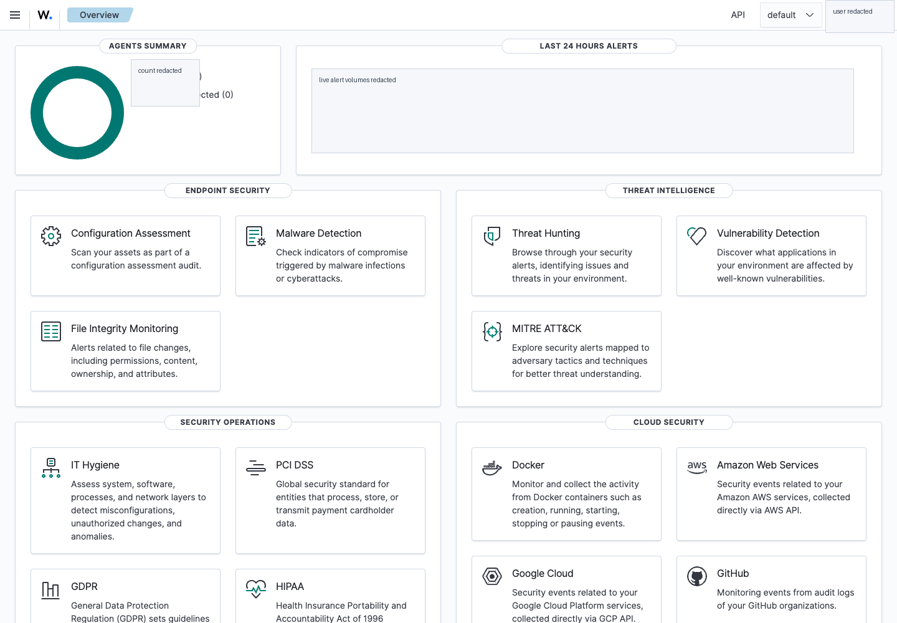

The authenticated Wazuh overview confirms active agents and security modules. Live alert volumes and user identity are redacted for public-safe reuse.

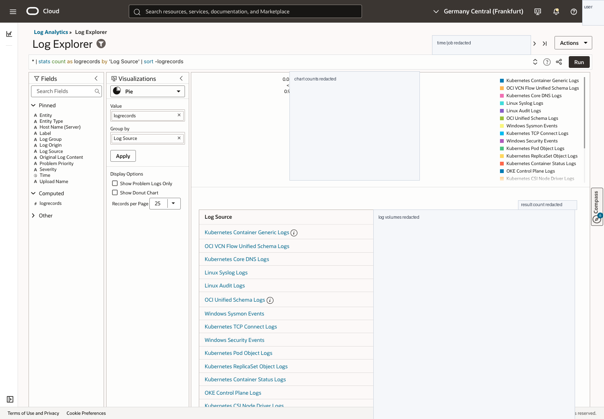

The Log Analytics screenshot shows source inventory and visualization setup. Live counts, job details, and user identity are redacted.

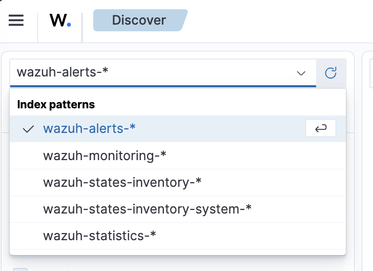

Use separate data views for Wazuh alerts, raw OCI Audit records, and raw VCN Flow records.

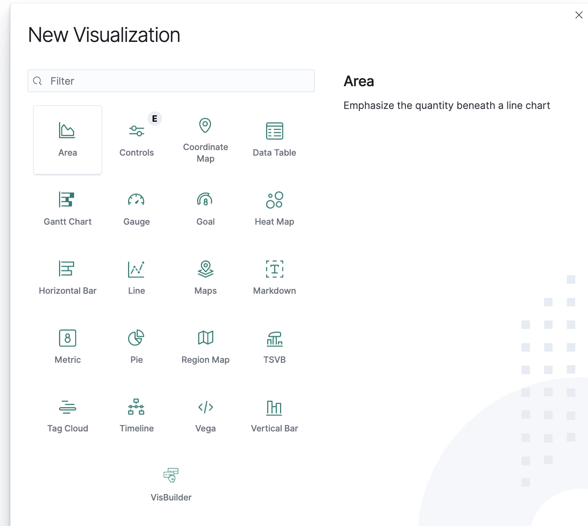

Use tables, bars, metrics, and time-series charts for the demo dashboards. Keep each widget tied to a specific investigation question.


The first lesson teaches the end-to-end correlation loop: choose signal, confirm source, validate detection, dashboard, then decide on a posture action.

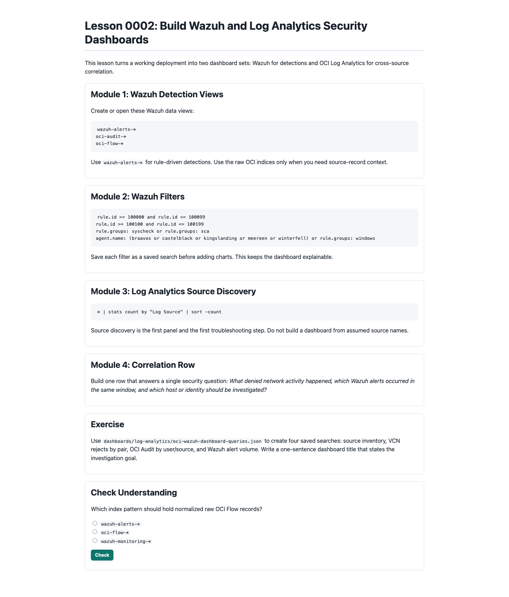

The second lesson teaches how to split Wazuh detection views from OCI Log Analytics correlation dashboards.

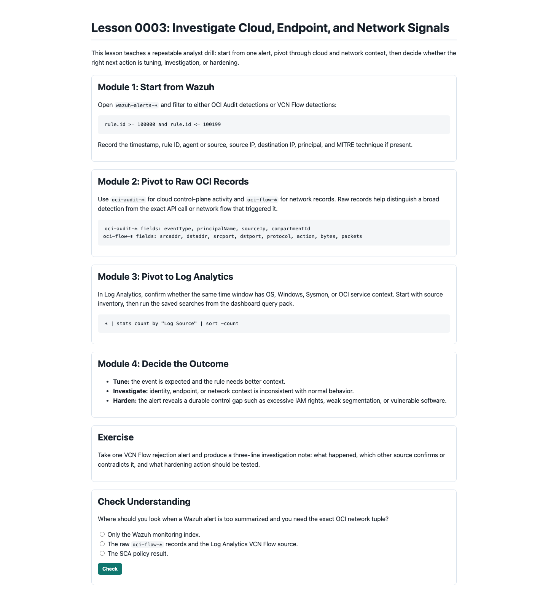

The third lesson walks an analyst from Wazuh alert to raw OCI record to Log Analytics context.

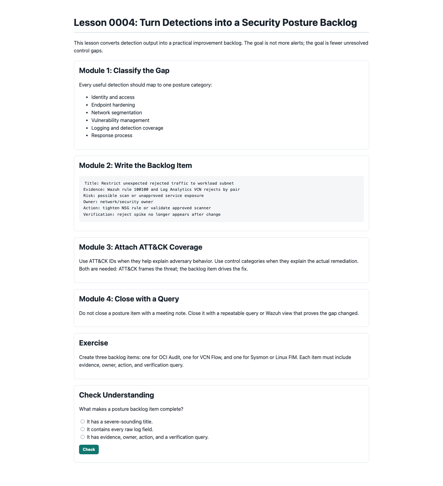

The fourth lesson turns detections into hardening work with evidence, owner, action, and verification query.

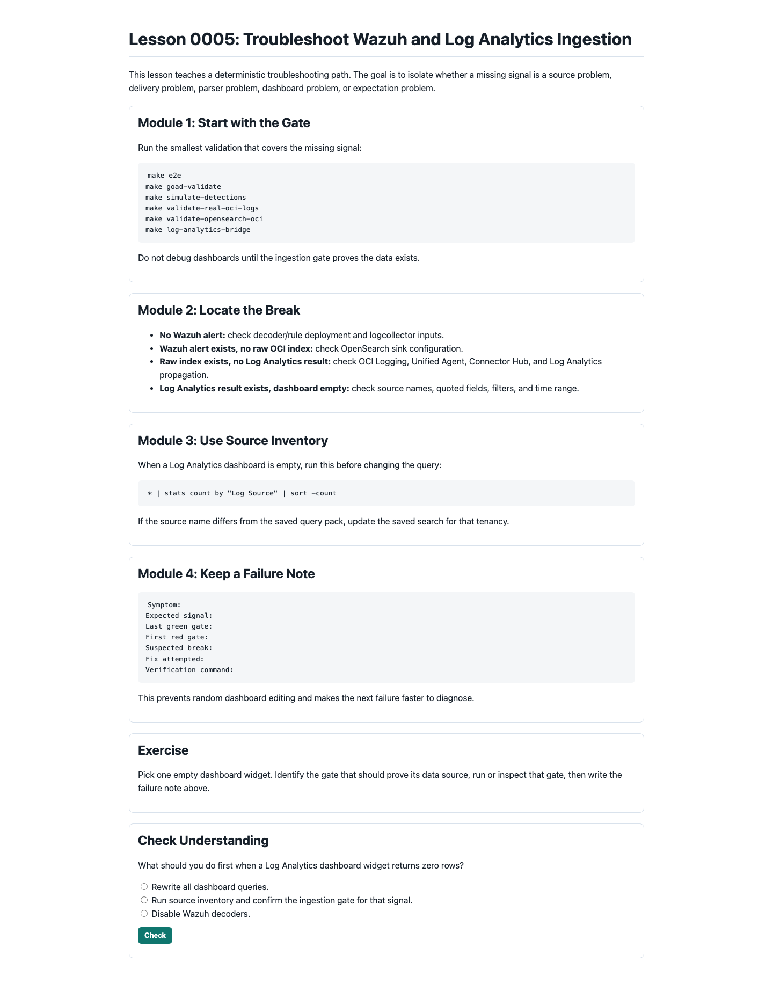

The fifth lesson teaches how to isolate missing telemetry without randomly editing dashboards.

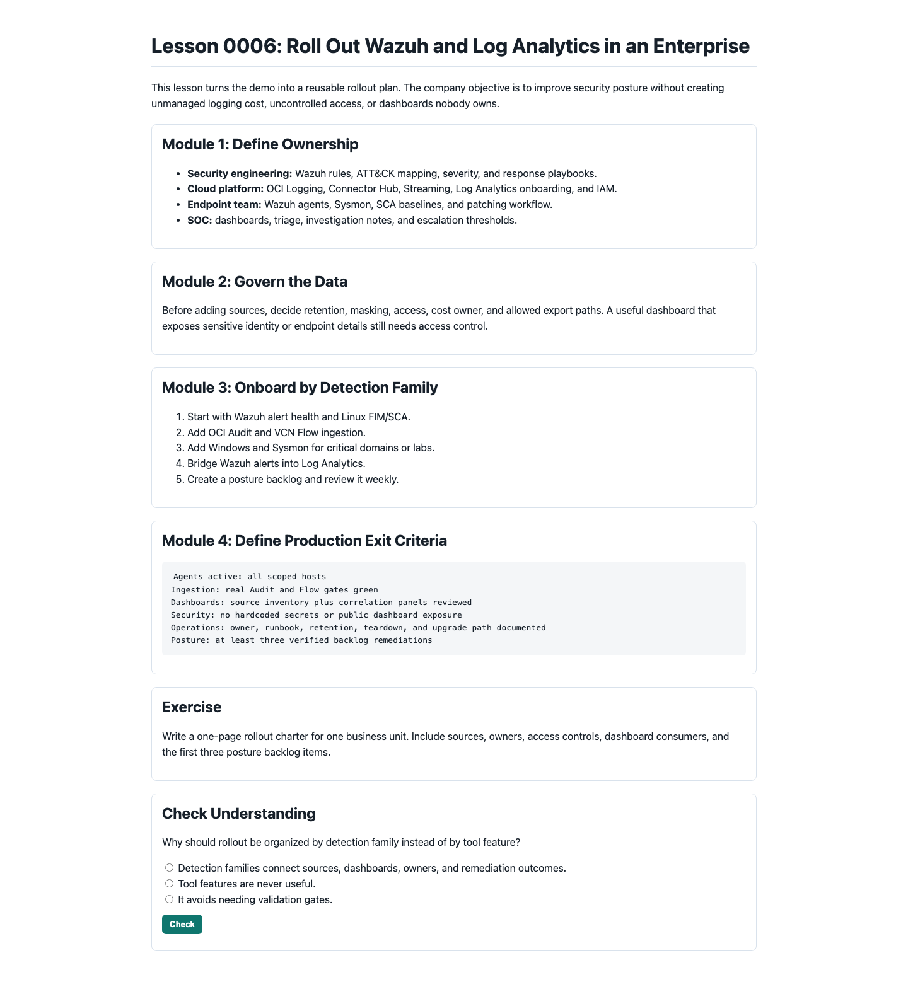

The sixth lesson turns the demo into a company rollout model with ownership, data governance, and production exit criteria.

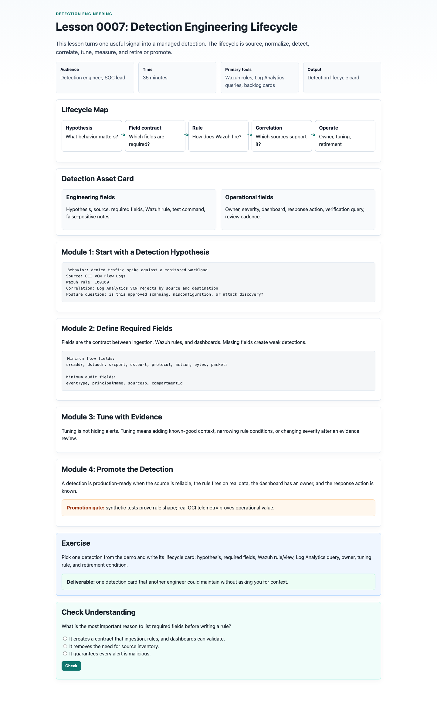

The seventh lesson shows how to manage detections as owned engineering assets.

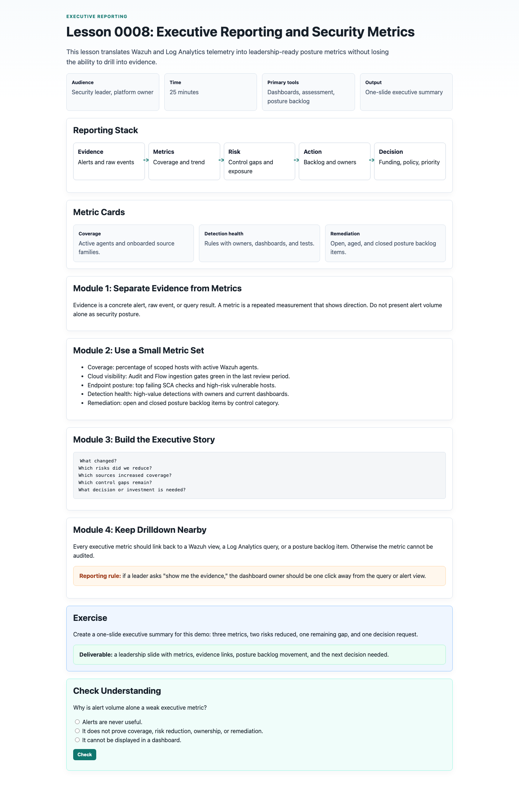

The eighth lesson converts technical telemetry into leadership-ready posture reporting.

## Architecture Mental Model

Wazuh is the detection workbench for endpoint and SIEM-style rules. It owns agent enrollment, log collection, FIM, SCA, syscollector, vulnerability detection, Windows/Sysmon detections, custom decoders, and rule IDs. In this lab, Wazuh also writes normalized OCI Audit and VCN Flow records into dedicated OpenSearch indices:

- `wazuh-alerts-*` for Wazuh detections and MITRE-mapped alerts
- `oci-audit-*` for normalized raw OCI Audit records
- `oci-flow-*` for normalized raw VCN Flow records

OCI Log Analytics is the correlation and enterprise dashboard layer. It should contain Wazuh alerts, OCI service logs, OS logs, Windows event logs, Sysmon logs, and entity metadata so teams can search across systems without forcing every raw source to become a Wazuh rule first.

## Module 1: Telemetry Inventory

Start every new tenancy with source discovery:

```text
* | stats count by "Log Source" | sort -count
```

This is not optional. Log Analytics source names and field availability can differ between tenancies. After source discovery, confirm the field names used by each widget. For example, a Windows query may use `"Event ID"` and `"Process Name"` rather than raw Sysmon field names, and host identity may be exposed as `Entity` instead of `HostName`.

Expected source families for this demo:

- Wazuh alert custom log
- OCI Audit Logs
- OCI VCN Flow Unified Schema Logs
- Linux Syslog Logs
- Linux Secure Logs
- Windows Security Events
- Windows System Events
- Windows Application Events
- Windows Sysmon Events

Validation command:

```bash
make log-analytics-bridge
```

## Module 2: Wazuh Endpoint Posture

Use Wazuh for endpoint-centered questions:

- What changed on a critical host? Use FIM and `syscheck` alerts.
- Which systems fail hardening checks? Use SCA alerts and policy results.
- Which agents have vulnerable packages? Use vulnerability detection and inventory.
- Which Windows hosts show suspicious process, network, or authentication behavior? Use Windows event logs, Sysmon, and SOC Fortress rules.
- Which detections map to ATT&CK techniques? Pivot on `rule.mitre.id`.

Required Wazuh views are documented in [OCI Wazuh Dashboard Views](../../dashboards/wazuh/oci-wazuh-views.md).

Hands-on command:

```bash
make e2e
```

Core Wazuh filters:

```text
rule.groups: syscheck or rule.groups: sca
agent.name: (braavos or castelblack or kingslanding or meereen or winterfell) or rule.groups: windows
```

## Module 3: OCI Cloud Telemetry in Wazuh

OCI Audit answers who changed cloud resources, from where, and against which target. VCN Flow Logs answer which network flows were accepted or rejected and which ports, protocols, and endpoints were involved.

The tested ingestion pattern is:

```text
OCI Audit API -> Wazuh consumer -> /var/ossec/logs/oci/audit.json -> Wazuh logcollector -> rules 100000-100099
VCN Flow Logs -> Connector Hub -> Streaming -> Wazuh consumer -> /var/ossec/logs/oci/flow.json -> Wazuh logcollector -> rules 100100-100199
```

The same consumer can also index records into OpenSearch:

```text
OCI Audit -> oci-audit-YYYY.MM.dd
VCN Flow -> oci-flow-YYYY.MM.dd
```

Use `wazuh-alerts-*` to investigate detections. Use `oci-audit-*` and `oci-flow-*` to inspect normalized source records.

Hands-on commands:

```bash
make wazuh-content
make simulate-detections
make validate-real-oci-logs
make opensearch-oci
make validate-opensearch-oci
```

## Module 4: Wazuh Alerts in OCI Log Analytics

Run the bridge path when you want enterprise correlation outside Wazuh:

```bash
make wazuh-log-analytics
make log-analytics-bridge
```

The bridge creates or reconciles the Wazuh alert custom log, Unified Agent tail configuration for `/var/ossec/logs/alerts/alerts.json`, OCI Logging resources, Connector Hub delivery to Log Analytics, and Log Analytics entities/source readiness checks.

Use the query pack in [OCI Wazuh Log Analytics Queries](../../dashboards/log-analytics/oci-wazuh-dashboard-queries.json). The first dashboard row should always be source inventory so operators can see whether the expected source families are present.

Hands-on commands:

```bash
make wazuh-log-analytics
make log-analytics-bridge
```

## Module 5: Correlation Patterns

| Pattern | Wazuh signal | Log Analytics correlation | Posture action |
|---|---|---|---|
| Denied traffic spike | VCN Flow rule `100100` | VCN rejects by source/destination plus Wazuh alert volume | Tighten NSGs, remove exposed listeners, validate scan source |
| Privileged cloud action | OCI Audit rule `100000` | OCI Audit event by user/source plus host alerts in same window | Review IAM policy, require MFA, reduce broad permissions |
| Host drift | FIM or SCA alert | Linux secure/syslog plus Wazuh alert and entity metadata | Patch baseline, enforce config management, add change approval |
| Windows lateral movement clue | Sysmon/SOC Fortress alert | Windows Sysmon network event plus failed logons and flow logs | Restrict admin paths, validate AD hygiene, improve segmentation |
| Vulnerable internet-facing host | Wazuh vulnerability alert | Vulnerability record plus VCN accepted ingress/egress flow | Patch or isolate, then verify exposure disappears |

Each correlation should end with one decision: accept, tune, investigate, or harden.

## Module 6: Dashboard Design

Build two complementary dashboard sets.

Wazuh dashboard views:

- OCI Audit Detections: rule IDs `100000-100099`
- VCN Flow Detections: rule IDs `100100-100199`
- Linux FIM and SCA
- GOAD Windows and Sysmon
- MITRE technique count by `rule.mitre.id`
- Raw OCI views using `oci-audit-*` and `oci-flow-*`

OCI Log Analytics dashboard widgets:

- Telemetry Source Inventory
- VCN Flow Actions
- VCN Rejects by Source and Destination
- OCI Audit Events by Type
- OCI Audit Events by User and Source
- GOAD Sysmon Event IDs
- GOAD Sysmon Network Connections
- Linux Host Logs by Source
- Wazuh Alert Volume
- Wazuh Alerts Raw Search

## Module 7: Posture Improvement Operating Model

Use this weekly loop:

1. Confirm ingestion health: source inventory, active Wazuh agents, recent Wazuh alerts, recent OCI Audit and VCN Flow records.
2. Review highest-volume and highest-severity detections.
3. Pivot each meaningful detection to an ATT&CK technique.
4. Identify whether the control gap is identity, endpoint hardening, network segmentation, vulnerability management, or logging coverage.
5. Create one remediation task with an owner and verification query.
6. Re-run the same Wazuh and Log Analytics views after the change.

This keeps the demo focused on posture improvement rather than alert volume.

## Module 8: Operations, Validation, and Teardown

Primary validation commands:

```bash
make e2e
make goad-validate
make wazuh-content
make simulate-detections
make validate-real-oci-logs
make opensearch-oci
make validate-opensearch-oci
make wazuh-log-analytics
make log-analytics-bridge
```

Teardown:

```bash
make down
```

The teardown path removes demo-owned cloud resources and cleans Wazuh/Sysmon agents from reused GOAD hosts. After teardown, run the project-tag search from [END_TO_END_DEMO](../END_TO_END_DEMO.md) to confirm no demo-owned resources remain.

## Companion Teaching Files

- [Mission](../../MISSION.md)
- [Curated resources](../../RESOURCES.md)
- [Printable reference](../../reference/0001-wazuh-log-analytics-security-posture.html)
- [Lesson 0001: SIEM correlation loop](../../lessons/0001-siem-correlation-loop.html)
- [Lesson 0002: build security dashboards](../../lessons/0002-build-security-dashboards.html)
- [Lesson 0003: investigate cloud, endpoint, and network signals](../../lessons/0003-investigate-cloud-endpoint-network.html)
- [Lesson 0004: turn detections into a posture backlog](../../lessons/0004-turn-detections-into-posture-backlog.html)
- [Lesson 0005: troubleshoot ingestion and dashboards](../../lessons/0005-troubleshoot-ingestion-and-dashboards.html)
- [Lesson 0006: enterprise rollout and governance](../../lessons/0006-enterprise-rollout-and-governance.html)
- [Lesson 0007: detection engineering lifecycle](../../lessons/0007-detection-engineering-lifecycle.html)
- [Lesson 0008: executive reporting and metrics](../../lessons/0008-executive-reporting-and-metrics.html)
- [Module index](WAZUH_LOG_ANALYTICS_MODULE_INDEX.md)
- [Query cookbook](WAZUH_LOG_ANALYTICS_QUERY_COOKBOOK.md)
- [Posture backlog template](WAZUH_LOG_ANALYTICS_POSTURE_BACKLOG_TEMPLATE.md)
- [Hands-on walkthrough](WAZUH_LOG_ANALYTICS_HANDS_ON.md)
- [Facilitator guide](WAZUH_LOG_ANALYTICS_FACILITATOR_GUIDE.md)
- [Assessment](WAZUH_LOG_ANALYTICS_ASSESSMENT.md)
- [End-to-end demo runbook](../END_TO_END_DEMO.md)
- [Ingestion KB](../kb/KB-OCI-WAZUH-INGESTION.md)
- [Detection KB](../kb/KB-OCI-WAZUH-DETECTIONS.md)

## Sources

- [Wazuh log data collection](https://documentation.wazuh.com/current/user-manual/capabilities/log-data-collection/index.html)
- [Wazuh decoders and rules](https://documentation.wazuh.com/current/user-manual/ruleset/index.html)
- [Wazuh file integrity monitoring](https://documentation.wazuh.com/current/user-manual/capabilities/file-integrity/index.html)
- [Wazuh Security Configuration Assessment](https://documentation.wazuh.com/current/user-manual/capabilities/sec-config-assessment/index.html)
- [Wazuh vulnerability detection](https://documentation.wazuh.com/current/user-manual/capabilities/vulnerability-detection/index.html)
- [Oracle Log Analytics](https://docs.oracle.com/en-us/iaas/log-analytics/home.htm)
- [OCI Audit overview](https://docs.oracle.com/en-us/iaas/Content/Audit/Concepts/auditoverview.htm)
- [OCI VCN Flow Logs](https://docs.oracle.com/en-us/iaas/Content/Network/Concepts/vcn_flow_logs.htm)
- [OCI Connector Hub](https://docs.oracle.com/en-us/iaas/Content/connector-hub/overview.htm)
- [MITRE ATT&CK Enterprise Matrix](https://attack.mitre.org/matrices/enterprise/)
